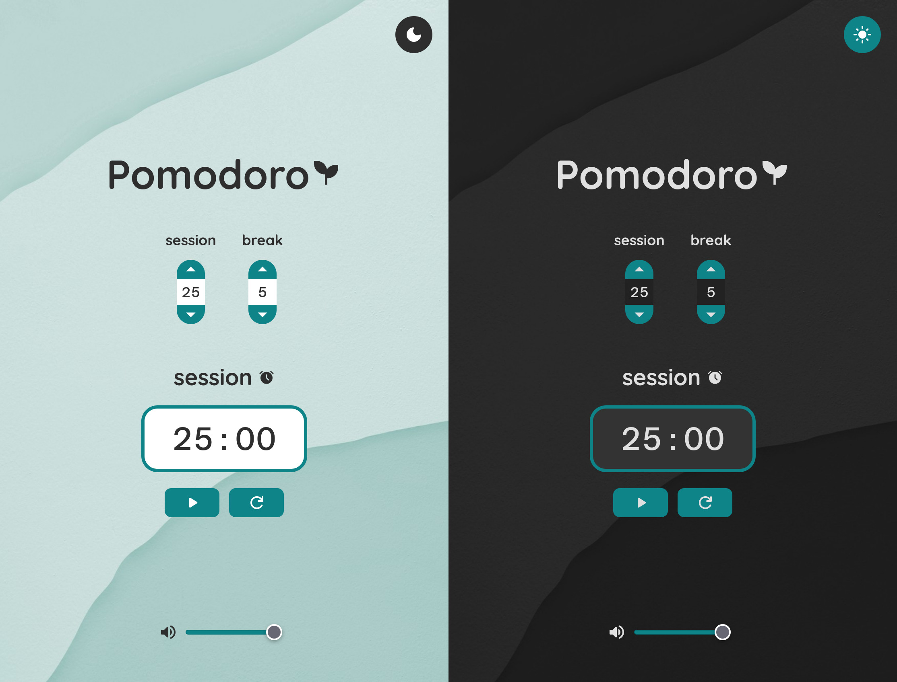

# Pomodoro
An implementation of the classic Pomodoro technique, featuring 25-minute work sessions to improve focus and productivity, with customizable session and break durations.


🔗 [View App](https://erfanazarmi.github.io/pomodoro/)

## Tech Stack
- React
- TypeScript
- Zustand
- Sass

## How to Run
This project uses [Vite](https://vitejs.dev/) for development.
1. Clone the repository
2. Install dependencies
```bash
npm install
```
3. Start the development server
```bash
npm run dev
```